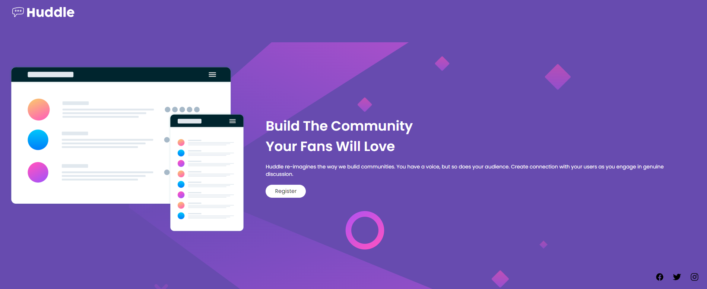

# Quest de HTML e CSS

Este projeto foi uma "quest" do curso, desenvolvida para aplicar conhecimentos de HTML e CSS e finalizar um módulo do curso. Trata-se de um projeto simples, focado em prática e entrega.

## Preview

## Tecnologias Utilizadas

- **HTML**: Usado para a estrutura da página
- **CSS**: Utilizado para estilização e layout

## Estrutura de Arquivos

- `index.html`: Página principal do projeto
- `style.css`: Arquivo principal de CSS para estilização
- `reset.css`: Arquivo para redefinir estilos padrão dos navegadores
